# Train Neural Networks on Amazon EC2 with GPU support

Workflow that shows how to train neural networks on EC2 instances with GPU support. 
The goal is to present a simple and stable setup to train on GPU instances by using **Docker** and the NVIDIA Container 
Runtime **nvidia-docker**. 

Two minimal examples are given to train:
 - a small built in Keras on MNIST image dataset
 - a multi-layer perceptron (MLP) and BERT model on [aclImdb](https://ai.stanford.edu/~amaas/data/sentiment) sentiment dataset for NLP 
   
It is shown that a 30-fold speedup in training time when training on GPU versus CPU can be achieved, **but** only in respect
to the applied model. E.g. for the MLP using CPU instances can be preferable.


## Getting started

1. Install [Docker](https://docs.docker.com/install/)

2. Install [Docker Machine](https://docs.docker.com/machine/install-machine/)

3. Install [AWS Command Line Interface](https://docs.aws.amazon.com/cli/latest/userguide/installing.html)


## Train locally on CPU

1. Build Docker images for CPU
```
docker build -t docker-keras-image . -f Image/Dockerfile.cpu
docker build -t docker-keras-nlp . -f NLP/Dockerfile.cpu
```

2. Run training container (**NB:** you might have to increase the container resources [[link](https://docs.docker.com/config/containers/resource_constraints/)])
```
docker run docker-keras-image
docker run docker-keras-nlp
```


## Train remote on GPU

1. Configure your AWS CLI. Ensure that your account has limits for GPU instances [[link](https://docs.aws.amazon.com/AWSEC2/latest/UserGuide/ec2-resource-limits.html)]

```
aws configure
```

2. Launch EC2 instance with **Docker Machine**. Choose an Ubuntu AMI based on your region (https://cloud-images.ubuntu.com/locator/ec2/).
For example, to launch a **p2.xlarge** EC2 instance named **ec2-p2** with a Tesla K80 GPU run
(**NB:** change region, VPC ID and AMI ID as per your setup)

```
docker-machine create --driver amazonec2 \
                      --amazonec2-region eu-central-1 \
                      --amazonec2-ami ami-0ae9bf04fb7c502ea \
                      --amazonec2-instance-type p2.xlarge \
                      --amazonec2-vpc-id vpc-b0ec4fda \
                      --amazonec2-root-size 100 \
                      ec2-gpu
```
```
docker-machine create --driver amazonec2 \
                        --amazonec2-region eu-central-1 \
                        --amazonec2-ami ami-0ae9bf04fb7c502ea \
                        --amazonec2-instance-type c5n.xlarge \
                        --amazonec2-root-size 100 \
                        --amazonec2-vpc-id vpc-b0ec4fda ec2-cpu 
```

3. ssh into instance

```
docker-machine ssh ec2-mp5
```

4. Run training container on CPU instance

```
sudo nvidia-docker run torlof/nlp-cpu-docker-keras
```

5. Run training container on CPU instance

```
sudo nvidia-docker run torlof/nlp-nvidia-docker-keras
```

This will pull the Docker image from [Dockerhub](https://hub.docker.com/r/torlof/nlp-nvidia-docker-keras).
The corresponding Dockerfile for image example is `idealo/nvidia-docker-keras` and can be found 
at [Idealo DockerHub](https://hub.docker.com/r/idealo/nvidia-docker-keras).


## Image classification example
### Training time comparison

We trained MNIST for 3 epochs (~98% accuracy on validation set):

• MacBook Pro (2.8 GHz Intel Core i7, 16GB RAM): **620 seconds**

• p2.xlarge (Tesla K80): **41 seconds**

• p3.2xlarge (Tesla V100): **20 seconds**

## Text classification example
For NLP use-case we trained on aclImdb dataset.

We want to test two text classification architectures:
 - large BERT model 
 - lightweight MLP with a rather simple embedding table

Since BERT is known for good performances on various tasks, lightweight MLP has its justification as it combines 
computational efficient wiht convincing performances. 

In addition we want to investigate the runtime performance for the low dimensional output (2 to 10 classes) and 
large-scale (up to 20000) cases. 

Since aclImdb is a binary classification problem we extend the dataset for multi-label classification by randomly
relabel the existing sample. (Note this makes the accuracy metrics useless.) Our focus in on runtime comparison. 

We have captured the training and inference runtime. Finally we are interested what instance provides use the 
best cost efficiency therefore we caputred the cost for training and inference.

### Training Runtime and Pricing
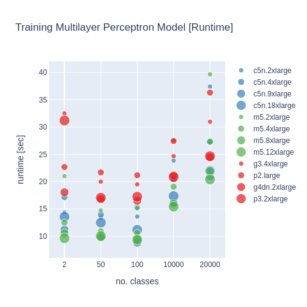 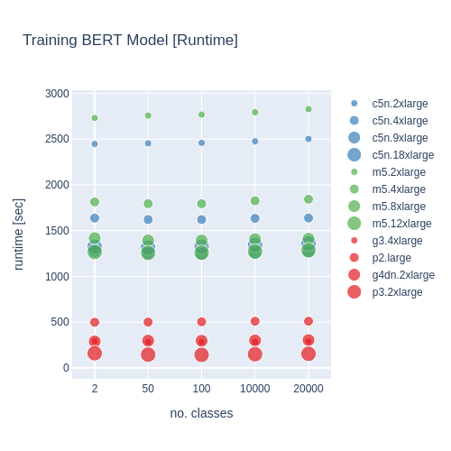

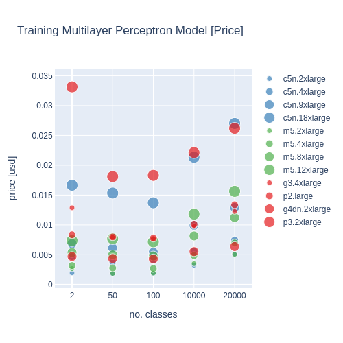 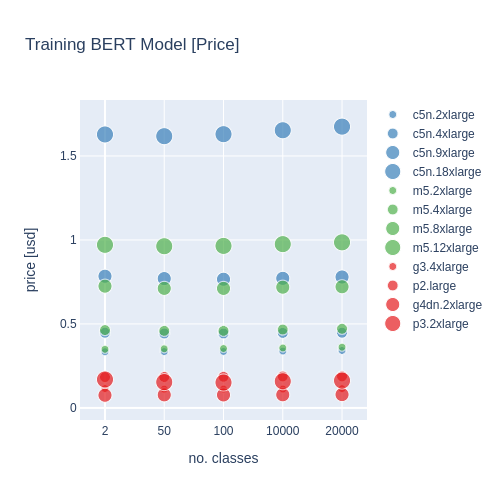

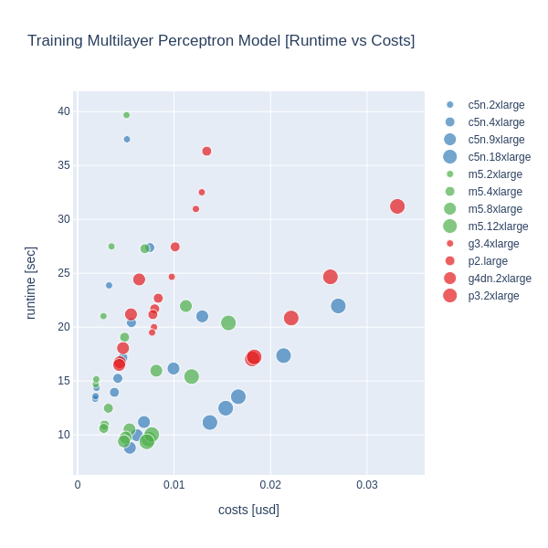 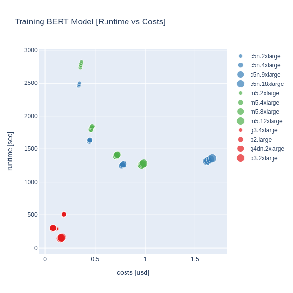

You can find these plots as interactive html plot at the **./plots** directory.

### Inference Runtime and Pricing

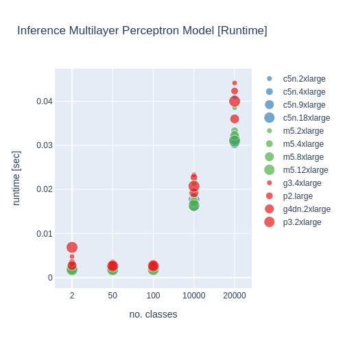 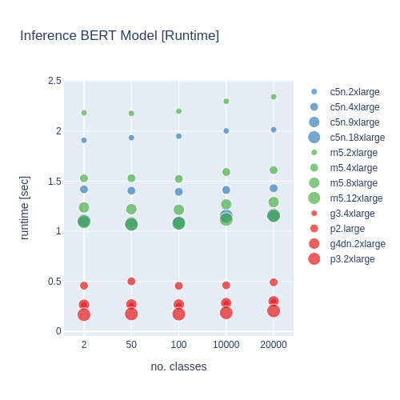

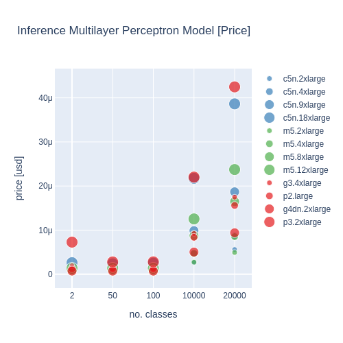 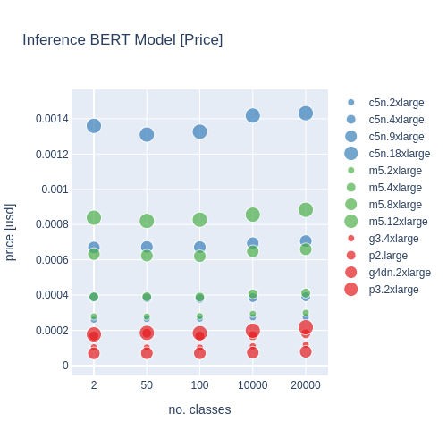


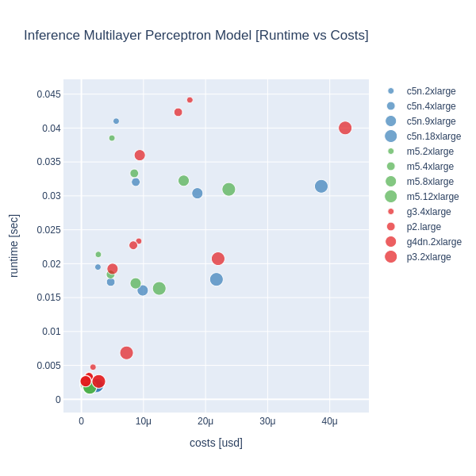 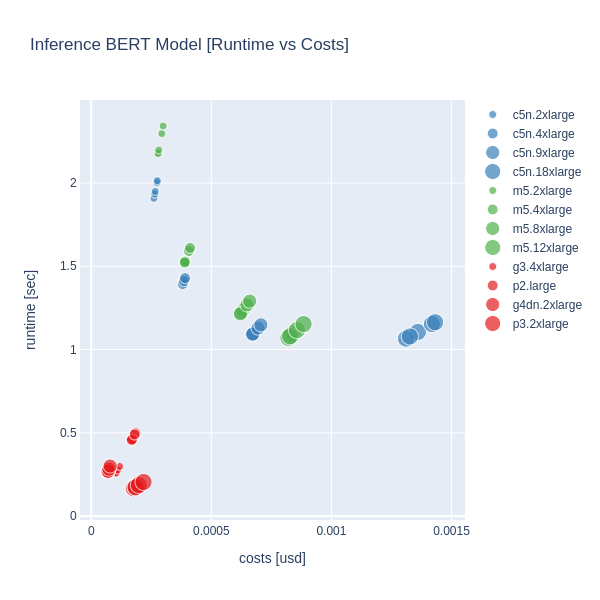

You can find these plots as interactive html plot at the **./plots** directory.

## Copyright

See [LICENSE](LICENSE) for details.
